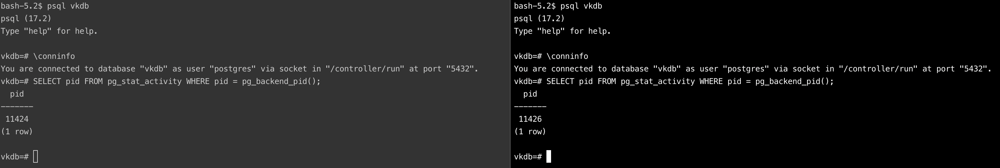
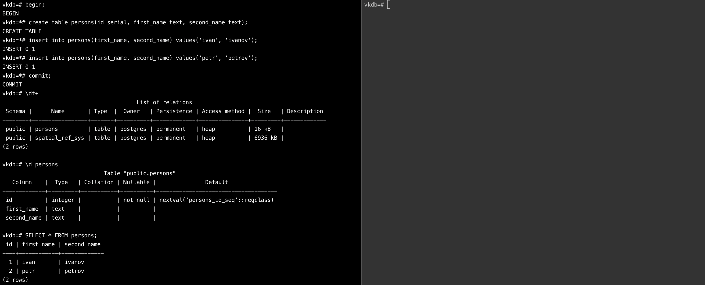
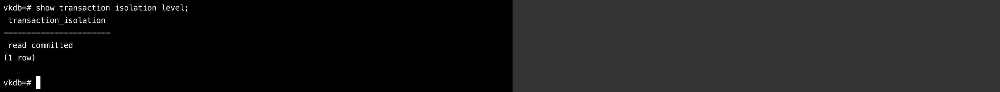
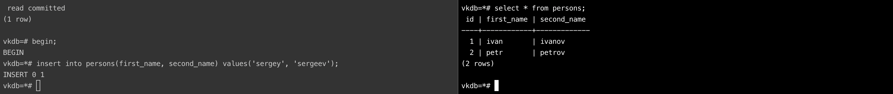
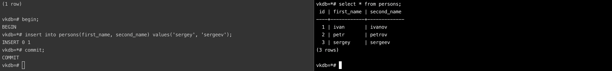
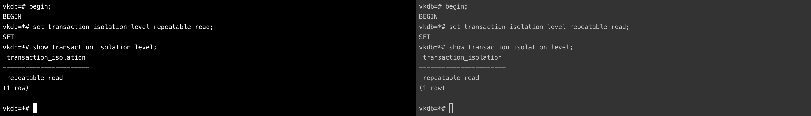
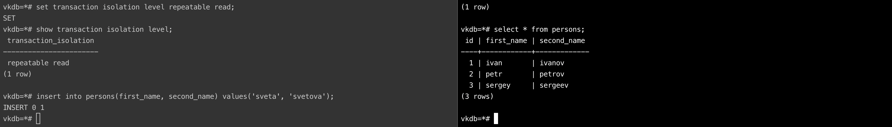
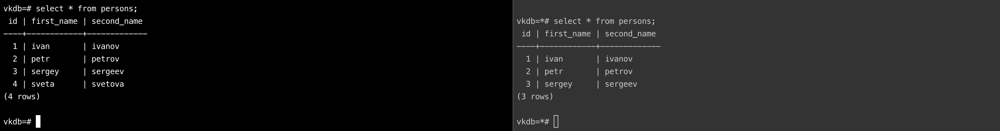
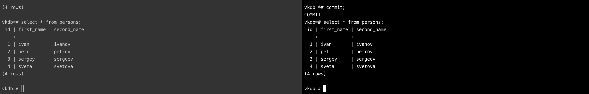

## Работа с уровнями изоляции транзакции в PostgreSQL

## Цель:
- научиться работать в Яндекс Облаке;
- научиться управлять уровнем изолции транзации в PostgreSQL и понимать особенность работы уровней read commited и repeatable read;

### Задание:
Осуществить соединение к PostgreSQL одной и той же БД в двух терминалах из-под пользователя postgres, убедиться в различии сессий:
~~~postgresql
psql <dbname>
\conninfo
SELECT pid FROM pg_stat_activity WHERE pid = pg_backend_pid();
~~~

В первой сессии новую таблицу и наполнить ее данными:
~~~postgresql
begin;
create table persons(id serial, first_name text, second_name text);
insert into persons(first_name, second_name) values('ivan', 'ivanov');
insert into persons(first_name, second_name) values('petr', 'petrov');
commit;
\dt+
\d persons
SELECT * FROM persons;
~~~
Создана таблица из 3 колонок; в таблицу вставлены две записи о пользователях

Посмотреть текущий уровень изоляции:
~~~postgresql
show transaction isolation level;
~~~
Текущий уровень изоляции - read commited

Начать новую транзакцию в обеих сессиях с дефолтным (не меняя) уровнем изоляции
- в первой сессии добавить новую запись
~~~postgresql
begin;
insert into persons(first_name, second_name) values('sergey', 'sergeev');
~~~
- сделать select from persons во второй сессии
~~~postgresql
begin;
select * from persons;
~~~
В первой сессии начата транзакция и вставлен очередной кортеж с пользователем. Во второй сессии выполнен вывод существующих пользователей

Вопрос: Видите ли вы новую запись и если да то почему?
> Ответ: Нет, кортеж, добавленный в первой сессии не отображается при запросе данных во второй. Связано это с наличием в PostgreSQL механизма MVCC:
> Каждая транзакция получает "своё" представление базы данных, то есть "снимок" данных, который включает в себя версии записей, актуальные на момент начала транзакции. 
> Пока транзакция не зафиксирована, изменения, сделанные в рамках этой транзакции, видны только этой транзакции.
> При чтении данных, транзакция обращается к той версии записи, которая была актуальна на момент её начала.

завершить первую транзакцию:
~~~postgresql
commit;
~~~
- сделать select from persons во второй сессии
~~~postgresql
select * from persons;
~~~
Выполнен коммит в первой сессии, запрошены данные во второй

Вопрос: Видите ли вы новую запись и если да то почему?
> Ответ: Да, теперь новый кортеж отображается. Транзакция в первой сессии завершилась, состояние обновилось, из-за уровня read-commited во второй транзакции при выполнении операции чтения во второй сессии дозволено увидеть изменения.

- завершить транзакцию во второй сессии:
~~~postgresql
commit;
~~~

Начать новые, но уже repeatable read транзакции:
~~~postgresql
begin;
set transaction isolation level repeatable read;
show transaction isolation level;
~~~
В обеих сессиях начаты новые транзакции, выставлен уровень изоляции как repetable read

- в первой сессии добавить новую запись:
~~~postgresql
insert into persons(first_name, second_name) values('sveta', 'svetova');
~~~

сделать select * from persons во второй сессии:
~~~postgresql
select * from persons;
~~~

Вопрос: Видите ли вы новую запись и если да то почему?
> Ответ: Нет, кортеж, добавленный в первой сессии не отображается при запросе данных во второй. Связано это с наличием в PostgreSQL механизма MVCC:

- завершить первую транзакцию:
~~~postgresql
commit;
~~~

- сделать select from persons во второй сессии:
~~~postgresql
select * from persons;
~~~

Вопрос: Видите ли вы новую запись и если да то почему?
> Ответ: Нет, новый кортеж во второй сессии не отображается, однако в первой сессии изменения есть. Транзакция в первой сессии завершилась, состояние обновилось, однако в режиме repetable-read видны только те данные, которые были зафиксированы до начала транзакции, но не видны незафиксированные данные и изменения, произведённые другими транзакциями в процессе выполнения данной транзакции.
> Последовательные команды SELECT в одной транзакции видят одни и те же данные; они не видят изменений, внесённых и зафиксированных другими транзакциями после начала их текущей транзакции.

- завершить вторую транзакцию
~~~postgresql
commit;
~~~

- сделать select * from persons во второй сессии
~~~postgresql
select * from persons;
~~~

Вопрос: Видите ли вы новую запись и если да то почему?
> Ответ: Да, теперь новый кортеж отображается во второй сессии. Теперь транзакция во второй сессии завершилась, repetable-read дозволяет увидеть состояние на момент выполнения операции