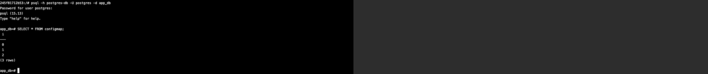

## Установка и настройка PostgteSQL в контейнере Docker

## Цель:
- установить PostgreSQL в Docker контейнере
- настроить контейнер для внешнего подключения

### Задание:
- Cоздать ВМ с Ubuntu 20.04/22.04 или развернуть докер любым удобным способом:
Исполнение производилось в среде VK Cloud, использовалась ВМ с образом Centos 8 Stream. 
Все последующие команды выполнялись согласно специфике Centos 8 и доступного пакетного менеджера Yum

- Поставить на нем Docker Engine
Выполнялись команды:
~~~bash
# обновление среды
sudo yum update -y
# установка требуемых пакетов
sudo yum install -y yum-utils device-mapper-persistent-data lvm2
# установка Docker Community Edition
sudo yum-config-manager --add-repo https://download.docker.com/linux/centos/docker-ce.repo
sudo yum install -y docker-ce docker-ce-cli containerd.io
# добавление текущего пользователя в группу docker, для последующей работы без sudo
user=$(whoami); echo $user
sudo usermod -aG docker $user
# запустим system-d docker службу и добавим ее в автозагрузку
sudo systemctl start docker
sudo systemctl enable docker
# выполним перезагрузку текущей сессии пользователя
# проверим версию docker
docker --version
~~~

- Cделать каталог /var/lib/postgres
~~~bash
sudo mkdir /var/lib/postgres
~~~

- Развернуть контейнер с PostgreSQL 15 смонтировав в него /var/lib/postgres
Для удобства развертывания пошел путем docker-compose:
~~~yml
version: '3.8'

services:
  postgres:
    image: postgres:15-alpine  # Используем Alpine для меньшего размера
    container_name: postgres-db
    environment:
      POSTGRES_USER: ${DB_USER:-postgres}
      POSTGRES_PASSWORD: ${DB_PASSWORD:-postgres}
      POSTGRES_DB: ${DB_NAME:-app_db}
      PGDATA: /var/lib/postgresql/data/pgdata
    volumes:
      - /var/lib/postgresql:/var/lib/postgresql/data
    ports:
      - "5432:5432"
    restart: unless-stopped
    healthcheck:
      test: ["CMD-SHELL", "pg_isready -U ${DB_USER:-postgres}"]
      interval: 5s
      timeout: 5s
      retries: 5
~~~

Поставим нужные права на директорию с данными
~~~bash
chown -R 999:999 /var/lib/postgresql # PostgreSQL в контейнере работает от пользователя с UID 999
~~~

Запустим, проверим логи и подключимся с хостовой машины
~~~bash
docker compose up -d
docker ps -a
docker logs postgres-db
docker exec -it postgres-db psql -U postgres -d app_db
\conninfo
~~~

- Развернуть контейнер с клиентом postgres
Добавим в docker-compose.yml секцию с 
~~~bash
  postgres-cli:
    image: postgres:15-alpine  # Используем Alpine для меньшего размера
    container_name: postgres-cli
    environment:
      POSTGRES_USER: ${DB_USER:-postgres}
      POSTGRES_PASSWORD: ${DB_PASSWORD:-postgres}
~~~
Alpine - наиболее легковесный образ, сразу содержащий клиент psql, прочую настройку для него выполнять не будем.
Открывать порты не будем, данный Postgres будет изолированным.

Поднимем контейнер с клиентом
~~~bash
docker compose up -d
docker ps -a
~~~

- Подключится из контейнера с клиентом к контейнеру с сервером и сделать таблицу с парой строк
~~~bash
docker exec -it postgres-cli bash
psql -h postgres-db -U postgres -d app_db
\conninfo
CREATE TABLE configmap (i integer);
INSERT INTO configmap VALUES (0), (1), (2);
\dt+
SELECT * FROM configmap;
~~~

- Подключится к контейнеру с сервером с ноутбука/компьютера извне инстансов ЯО/места установки докера
Предварительно на ВМ в облачном контуре VK CLoud был выделен "белый" IP-адрес и открыт порт 5432 "наружу". 
- Во время поднятия контейнера postgres-db был осуществлен проброс портов с хоста внутрь контейнера.
~~~bash
PGPASSWORD='postgres' psql -h <fip> -p 5432 -U postgres -d app_db
\conninfo
SELECT * FROM configmap;
~~~

- Удалить контейнер с сервером
~~~bash
docker compose down
docker ps -a
~~~

- Создать его заново
~~~bash
docker compose up -d
docker ps -a
~~~

- Подключится снова из контейнера с клиентом к контейнеру с сервером и проверить, что данные остались на месте
~~~bash
docker exec -it postgres-cli bash
psql -h postgres-db -U postgres -d app_db
\conninfo
SELECT * FROM configmap;
~~~

> Видим, что данные присутствуют по причине того, что существует точка монтирования с хоста внутрь контейнера.
