## Установка и настройка PostgreSQL

## Цель:
- создавать дополнительный диск для уже существующей виртуальной машины, размечать его и делать на нем файловую систему
- переносить содержимое базы данных PostgreSQL на дополнительный диск
- переносить содержимое БД PostgreSQL между виртуальными машинами

### Задание:
- Cоздайте виртуальную машину c Ubuntu 20.04/22.04 LTS в ЯО/Virtual Box/докере 
Исполнение производилось в среде VK Cloud, использовалась ВМ с образом Centos 8 Stream. 
Все последующие команды выполнялись согласно специфике Centos 8 и доступного пакетного менеджера Yum
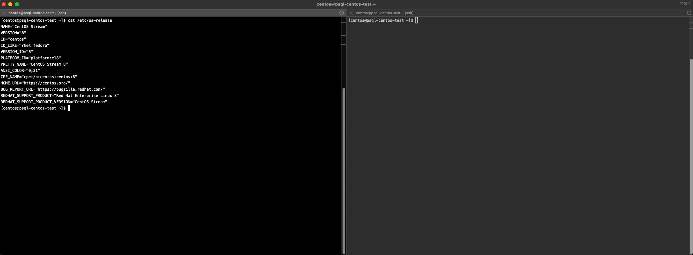

- Поставьте на нее PostgreSQL 15 через sudo apt
Установку будем производить через пакетный менеджер dnf
Запросим все существующие пакеты postgresql
```bash
dnf module list postgresql
```
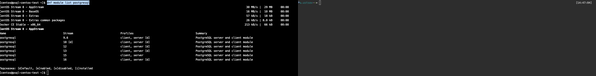

Запросим модуль для 15-ой версии
```bash
sudo dnf module enable postgresql:15
```

Установим пакет для установки postgresql
```bash
sudo dnf install -y postgresql-server
```
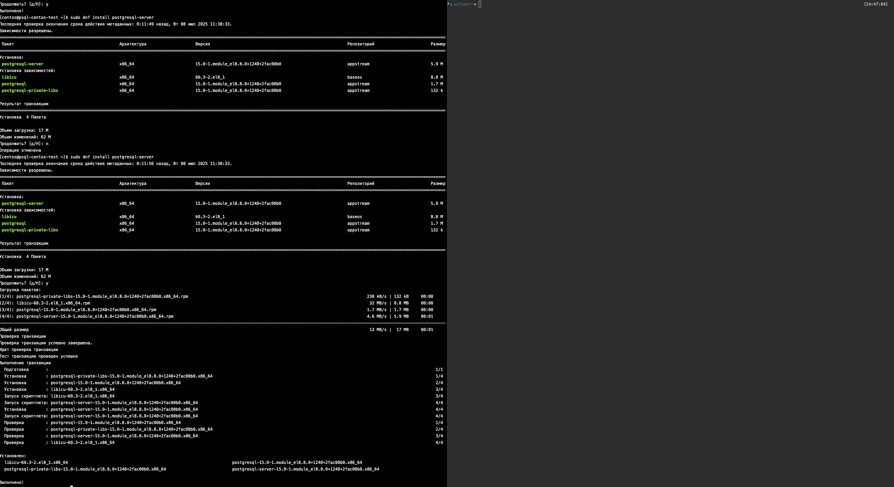

Установим сам postgresql, запустим его службу и добавим службу в автозагрузку. Выведем статус работы службы
```bash
sudo postgresql-setup --initdb
sudo systemctl start postgresql
sudo systemctl enable postgresql
sudo systemctl status postgresql
```
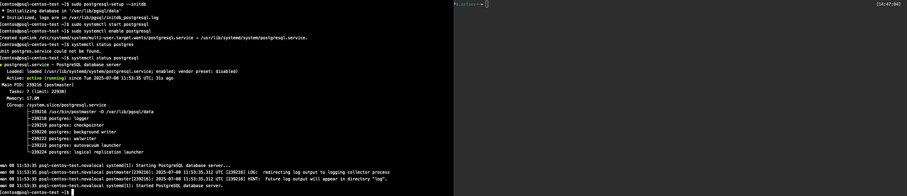

- Проверьте что кластер запущен через sudo -u postgres pg_lsclusters
При установке через dnf данного пакета не оказалось, поэтому пойдем через pg_isready
```bash
sudo -i -u postgres
pg_isready
```
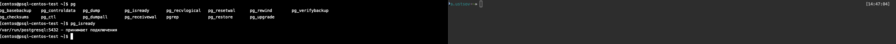

- Зайдите из-под пользователя postgres в psql и сделайте произвольную таблицу с произвольным содержимым
```postgresql
psql -l
psql postgres
SELECT version();
CREATE TABLE test(c1 text);
INSERT INTO test values('1');
SELECT * FROM test;
\quit
```
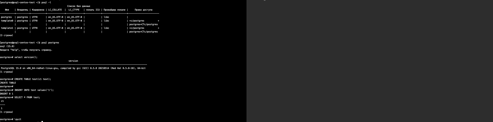

- Oстановите postgres например через sudo -u postgres pg_ctlcluster 15 main stop
При установке через dnf данного пакета не оказалось, поэтому пойдем через systemctl
```bash
sudo systemctl stop postgresql
pg_isready
```
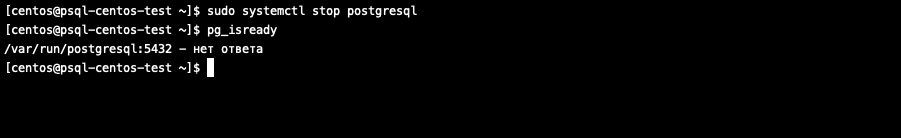

- Cоздайте новый диск к ВМ размером 10GB
В VK Cloud используется технология Openstack, в частности для управления дисковой подсистемой сервис Cinder.
- Добавьте свежесозданный диск к виртуальной машине.
При помощи UI создадим новый ssd-диск на 10GB и сразу подмонтируем его к созданной ВМ c postgresql.
- Проинициализируйте диск согласно инструкции и подмонтировать файловую систему, только не забывайте менять имя диска на актуальное, в вашем случае это скорее всего будет /dev/sdb - https://www.digitalocean.com/community/tutorials/how-to-partition-and-format-storage-devices-in-linux
- Перезагрузите инстанс и убедитесь, что диск остается примонтированным (если не так смотрим в сторону fstab)
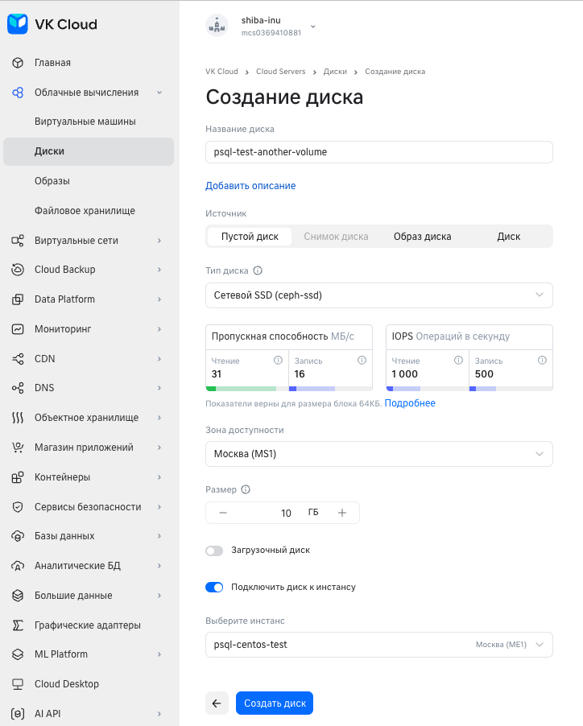

После монтирования убедимся, что диск в наличии, но не размечен:
```bash
df -hT
lsblk
```
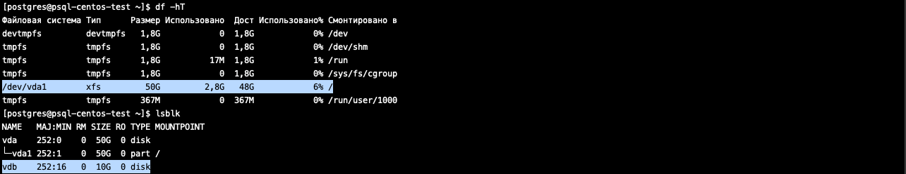

Команда lsblk отображает новое доступное блочное устройство (vdb), что появилось после маунта диска, однако df -h, не отображает размеченную точку монтирования - отсутствует файловая система.
Также видим, что рутовая точка (/) размечена как xfs, для нового диска выполним разметку таким же образом, используя следующие команды:
```bash
sudo -Hsu root
sudo mkfs.xfs -f /dev/vdb
sudo mkdir -p /mnt/data
sudo mount -t xfs -o noatime,nodiratime /dev/vdb /mnt/data
sudo grep /dev/vdb /etc/mtab >> /etc/fstab
```
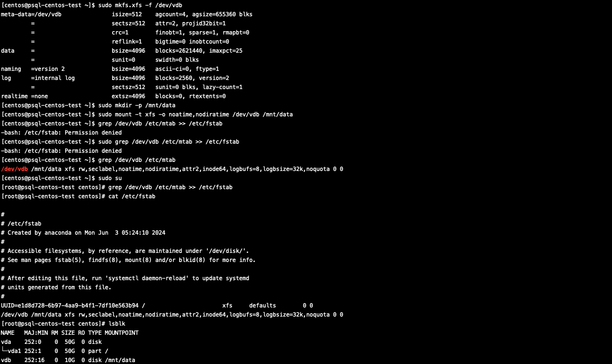

Проверим, что диск примантирован, размечен и работоспособен
```bash
df -hT
sudo touch /mnt/data/file.txt
sudo echo "hello" >> /mnt/data/file.txt
sudo cat /mnt/data/file.txt
sudo rm -f /mnt/data/file.txt
```
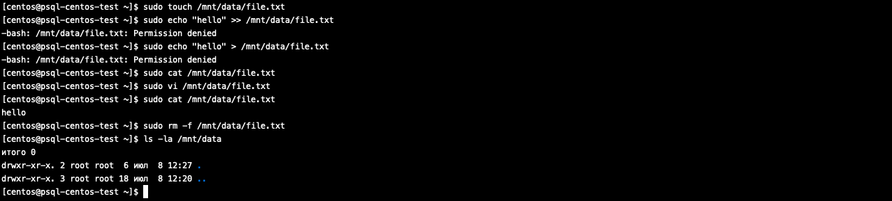

- Перенесите содержимое /var/lib/postgresql/15 в /mnt/data
```bash
sudo mv /var/lib/pgsql/ /mnt/data
```

- Сделайте пользователя postgres владельцем /mnt/data

```bash
sudo chown -R postgres:postgres /mnt/data
sudo chmod 750 /mnt/data/pgsql/data
sudo ls -la /mnt/data/pgsql
```
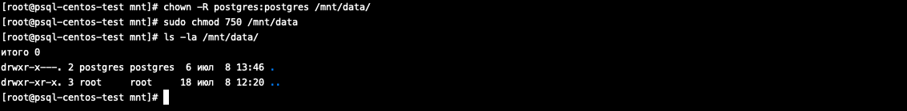

- Попытайтесь запустить кластер
Выполним, как в шаге ранее:
```bash
sudo systemctl start postgresql
sudo systemctl status postgresql
```
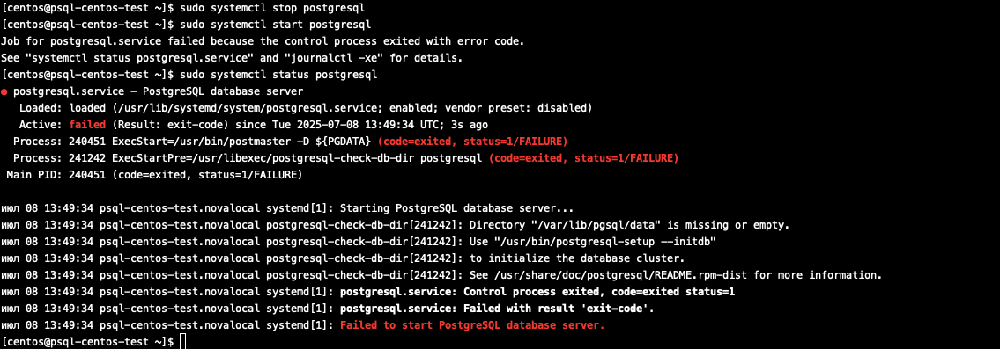

- Напишите получилось или нет и почему:
> Запустить не получилось, служба упала в ошибку, так как считает, что не существует директории с данными и предлагает вновь инициализировать БД. Не получилось, так как в службе postgresql изначально прописана директория с данными, с которой требуется работать. Для этого используется переменная PGDATA. Исправим ее на новый путь - на внешний диск.

Отредактирована переменная Environment=PGDATA=/var/lib/pgsql/data на Environment=PGDATA=/mnt/data/pgsql/data в файле службы:
```bash
sudo vi /usr/lib/systemd/system/postgresql.service
```

Перезапущен systemd и запущен postgresql:
```bash
sudo systemctl daemon-reload
sudo systemctl start postgresql
sudo systemctl status postgresql
```
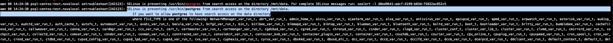

> Запустить вновь не удалось, в ошибках journalctl сообщения ошибки selinux. После отключения selinux база запустилась, что подвержает гипотезу.
> Поправим конфигурацию selinux, чтобы было дозволено работать с новой директорией
```bash
sudo semanage fcontext -a -t postgresql_db_t "/mnt/data(/.*)?"
sudo restorecon -R /mnt/data
```
> После изменения политик selinux postgresql успешно запустился
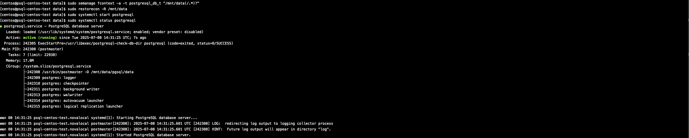

- Зайдите через через psql и проверьте содержимое ранее созданной таблицы
```bash
sudo -i -u postgres
psql postgres
SELECT * from test;
\quit
```
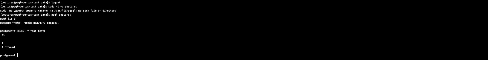

- Задание со звездочкой *: 
- Не удаляя существующий инстанс ВМ сделайте новый, поставьте на него PostgreSQL, удалите файлы с данными из /var/lib/postgres, 
- перемонтируйте внешний диск, который сделали ранее от первой виртуальной машины ко второй и запустите PostgreSQL на второй машине так, чтобы он работал с данными на внешнем диске, расскажите как вы это сделали и что в итоге получилось.
> Поднята аналогичная первой ВМ, установлен postgresql согласно шагам выше.
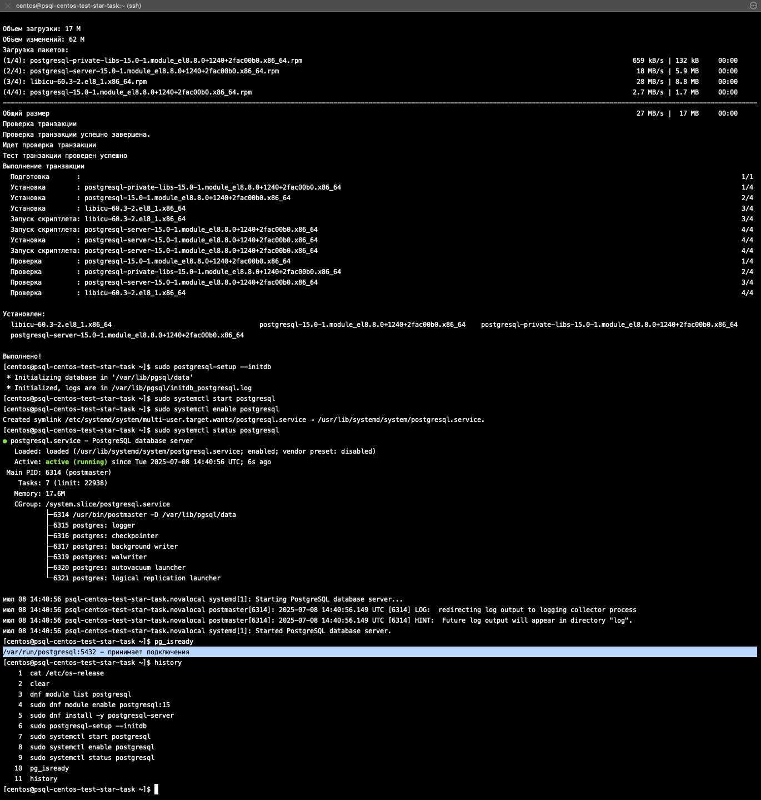

> От прежней ВМ диск деаттачнут и присоединен ко второй - все средствами UI облака. Так как диск уже ранее был размечен под xfs, его нужно только примаунтить к ВМ.
~~~bash
lsblk
df -hT
sudo mkdir -p /mnt/data
sudo mount /dev/vdb /mnt/data
df -hT
~~~
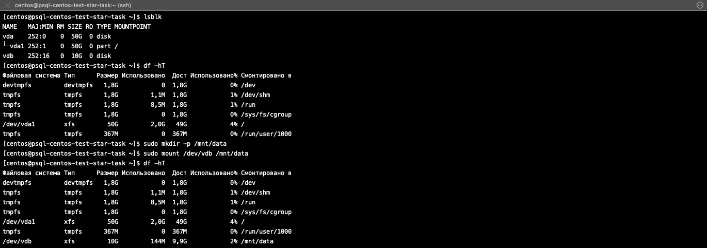

> На новой ВМ postrgesql предварительно остановлен, данные из /var/lib/pgsql удалены
```bash
sudo systemctl stop postgresql
sudo systemctl status postgresql
pg_isready
sudo -i -u postgres
rm -rf data
```
> Попытка запустить postgresql проваливается, что директории с данными не существует.
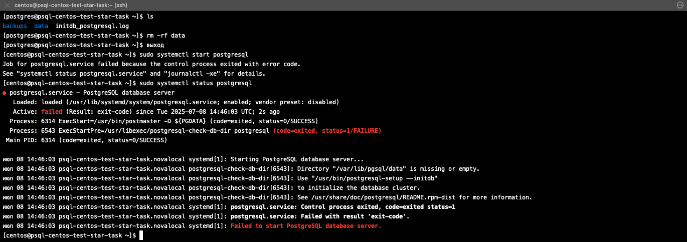

На директорию с данными на внешнем диске назначены права postgres:postgres:
```bash
sudo chown -R postgres:postgres /mnt/data
sudo chmod 750 /mnt/data/pgsql/data
sudo ls -la /mnt/data/pgsql
```

Отредактирована переменная Environment=PGDATA=/var/lib/pgsql/data на Environment=PGDATA=/mnt/data/pgsql/data в файле службы:
```bash
sudo vi /usr/lib/systemd/system/postgresql.service
```

Поправлены политики selinux
```bash
sudo semanage fcontext -a -t postgresql_db_t "/mnt/data(/.*)?"
sudo restorecon -R /mnt/data
```

Перезапущен systemd и запущен postgresql:
```bash
sudo systemctl daemon-reload
sudo systemctl start postgresql
sudo systemctl status postgresql
pg_isready
sudo -i -u postgres
psql postgres
SELECT * FROM test;
```
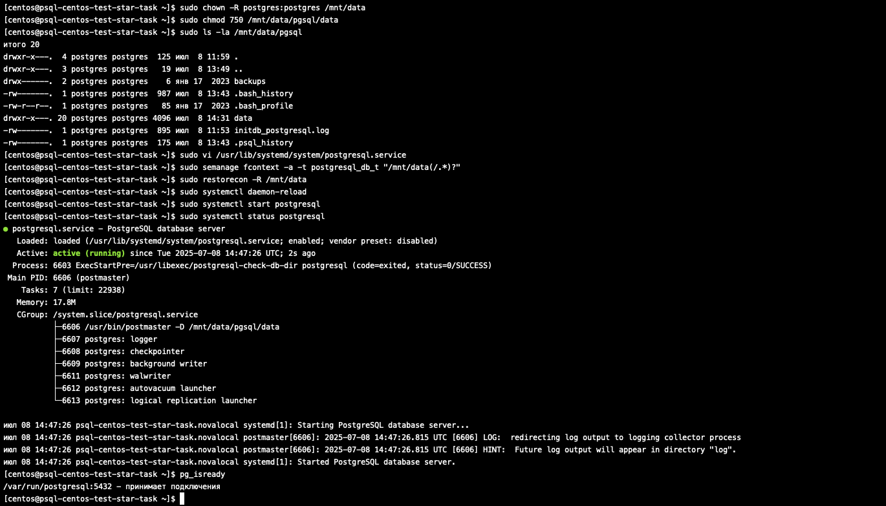
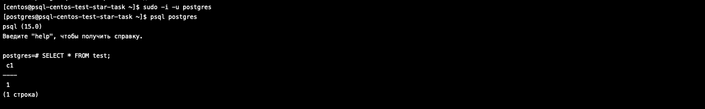

> База доступна, данные в наличии.
