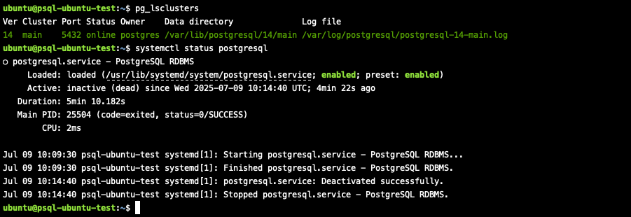
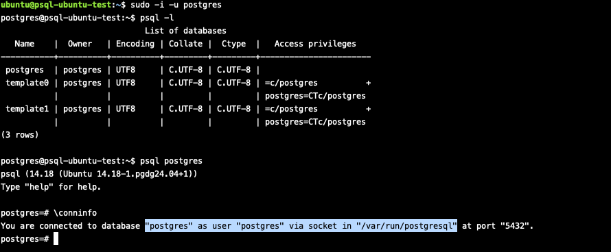
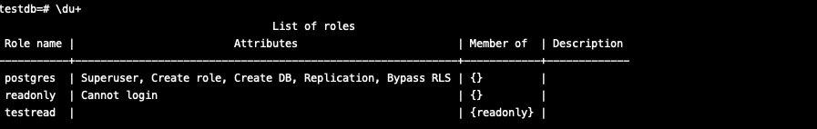
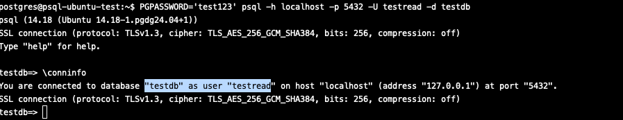

## Работа с базами данных, пользователями и правами

## Цель:
- создание новой базы данных, схемы и таблицы
- создание роли для чтения данных из созданной схемы созданной базы данных
- создание роли для чтения и записи из созданной схемы созданной базы данных

### Задание:
1. создайте новый кластер PostgresSQL 14
```bash
# В этот раз решил попробовать поднять на ubuntu 24.04
sudo apt update
sudo apt upgrade -y
sudo sh -c 'echo "deb http://apt.postgresql.org/pub/repos/apt $(lsb_release -cs)-pgdg main" > /etc/apt/sources.list.d/pgdg.list'
wget --quiet -O - https://www.postgresql.org/media/keys/ACCC4CF8.asc
sudo apt-key add - 
sudo apt-get update 
sudo apt-get -y install postgresql-14
sudo apt install unzip
sudo apt -y install mc
sudo -u postgres pg_createcluster 14 main --start
```


2. зайдите в созданный кластер под пользователем postgres
```bash
sudo -i -u postgres
psql -l
psql postgres
\conninfo
```


3. создайте новую базу данных testdb
```postgresql
CREATE DATABASE testdb;
```
4. зайдите в созданную базу данных под пользователем postgres
```postgresql
\c testdb;
```
5. создайте новую схему testnm
```postgresql
CREATE SCHEMA testnm;
```
6. создайте новую таблицу t1 с одной колонкой c1 типа integer
```postgresql
CREATE TABLE t1 (c1 integer);
```
7. вставьте строку со значением c1=1
```postgresql
INSERT INTO t1 (c1) VALUES (1);
```
8. создайте новую роль readonly
```postgresql
CREATE ROLE readonly;
```
9. дайте новой роли право на подключение к базе данных testdb
```postgresql
GRANT CONNECT ON DATABASE testdb TO readonly;
```
10. дайте новой роли право на использование схемы testnm
```postgresql
GRANT USAGE ON SCHEMA testnm TO readonly;
```
11. дайте новой роли право на select для всех таблиц схемы testnm
```postgresql
GRANT SELECT ON ALL TABLES IN SCHEMA testnm TO readonly;
```
12. создайте пользователя testread с паролем test123
```postgresql
CREATE ROLE testread WITH LOGIN PASSWORD 'test123';
```
13. дайте роль readonly пользователю testread
```postgresql
GRANT readonly to testread;
```


14. зайдите под пользователем testread в базу данных testdb
```postgresql
PGPASSWORD='test123' psql -h localhost -p 5432 -U testread -d testdb
\conninfo
```


15. сделайте
```postgresql
SELECT * FROM t1;
```
16. Получилось? (могло если вы делали сами не по шпаргалке и не упустили один существенный момент про который позже). Напишите что именно произошло в тексте домашнего задания. У вас есть идеи почему? ведь права то дали? Посмотрите на список таблиц. А почему так получилось с таблицей (если делали сами и без шпаргалки то может у вас все нормально)
> В моем случае вызов команды на чтение из t1 не увенчался успехом, потому что таблица была создана в public схеме (в задании не было явно указано, в какой схеме создавать, вначале сделал в testnm, потом передумал и сделал явно в public), но пользователю readonly (а в последствии testdb, так как наследуется от readonly) не было дано право на работу с public схемой. Если бы создалась таблица в созданной схеме testnm, то запрос также выдавал бы ошибку, потому что не была указана явно схема testnm, а search_path по умолчанию содержит $user (что не совпадает с именем БД testnm) и public. В случае, если указывать схему явно - нам удастся прочитать данные, потому что мы явно сделали GRANT SELECT 
17. вернитесь в базу данных testdb под пользователем postgres
18. удалите таблицу t1
```postgresql
DROP TABLE t1;
```
19. создайте ее заново но уже с явным указанием имени схемы testnm
```postgresql
CREATE TABLE testnm.t1 (c1 integer);
```
20. вставьте строку со значением c1=1
```postgresql
INSERT INTO testnm.t1 (c1) VALUES (1);
```
21. зайдите под пользователем testread в базу данных testdb
22. сделайте  
```postgresql
SELECT * FROM testnm.t1;
```
23. получилось? есть идеи почему?
> В данном случае не получилось, потому что отношение было пересоздано, а грант был сделан ранее и выдалася только на существующие на тот моменты объекты в БД
25. как сделать так чтобы такое больше не повторялось? если нет идей - смотрите шпаргалку
```postgresql
psql -d testdb
ALTER DEFAULT PRIVILEGES IN SCHEMA testnm GRANT SELECT ON TABLES TO readonly;
```
26. сделайте
```postgresql
SELECT * FROM testnm.t1;
```
27. получилось? есть идеи почему? если нет - смотрите шпаргалку
> Нет, снова запрос не выполнился из-за ограничения прав доступа на схему. ALTER DEFAULT будет действовать для НОВЫХ таблиц, а GRANT SELECT ON ALL TABLES IN SCHEMA testnm TO readonly отработал только для существующих на тот момент времени. Надо сделать снова или GRANT SELECT или пересоздать таблицy
```postgresql
psql -d testdb
GRANT SELECT ON ALL TABLES IN SCHEMA testnm TO readonly;
\c testdb testread;
```
29. сделайте
```postgresql
SELECT * FROM testnm.t1;
```
30. получилось? ура!
> Да, после выполнения GRANT SELECT удалось прочитать данные
31. теперь попробуйте выполнить команду
```postgresql
CREATE TABLE t2(c1 integer);
INSERT INTO t2 values (2);
```
32. а как так? нам же никто прав на создание таблиц и insert в них под ролью readonly?
> Создали все в схеме public, грант на работу со схемой public дается роли public, от которой наследуются все последующие создаваемые роли (в т.ч наша readonly и testread)
33. есть идеи как убрать эти права? если нет - смотрите шпаргалку
> Сделать revoke на все операции у роли паблик на схему паблик
```postgresql
psql -d testdb
REVOKE CREATE on SCHEMA public FROM public;
REVOKE ALL on DATABASE testdb FROM public;
```
34. если вы справились сами то расскажите что сделали и почему, если смотрели шпаргалку - объясните что сделали и почему выполнив указанные в ней команды 
35. теперь попробуйте выполнить команду 
```postgresql
CREATE TABLE t3(c1 integer);
INSERT INTO t2 values (2);
```
36. расскажите что получилось и почему
> CREATE TABLE упала в ошибку по правам, а INSERT INTO выполнилась успешно. Дело в том, что REVOKE CREATE ON SCHEMA отобрала права только на создание НОВЫХ объектов (таблиц, индексов и т.д), а REVOKE ALL ON DATABASE забрала привелегии на уровень всей БД, не забирая при этом привелегии на созданные объекты внутри БД.
> Можно попробовать сделать явно REVOKE INSERT ON t2 FROM testread, но именно на него, а не public, ибо testread, уже отнаследован от public, гранты на нем сохранятся