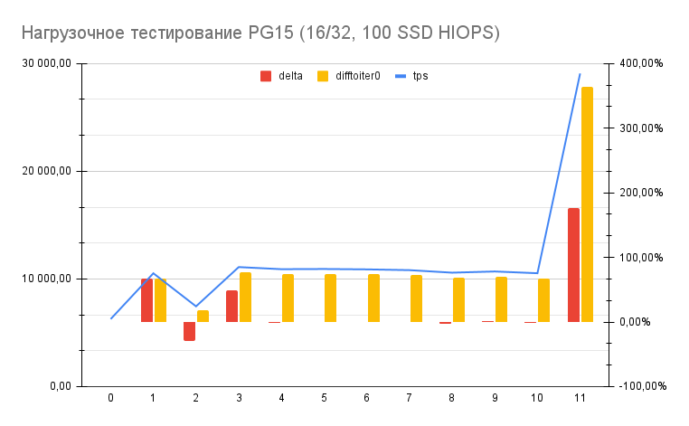

## Нагрузочное тестирование и тюнинг PostgreSQL

## Цель:
- сделать нагрузочное тестирование PostgreSQL
- настроить параметры PostgreSQL для достижения максимальной производительности

### Задание:
1. развернуть виртуальную машину любым удобным способом
> В моем случае, была поднята ВМ:
> на Intel ICE Lake 4CPU/16RAM
> Ubuntu 22.04, рутовый диск на ext4
> 100ГБ SSD-HIIOPS, флейвор с переподпиской (могут оказывать влияние "шумные соседи"
> NUMA, multiqueue
2. поставить на неё PostgreSQL 15 любым способом
```bash
# В этот раз решил попробовать поднять на ubuntu 24.04
sudo apt update
sudo apt upgrade -y
sudo sh -c 'echo "deb http://apt.postgresql.org/pub/repos/apt $(lsb_release -cs)-pgdg main" > /etc/apt/sources.list.d/pgdg.list'
wget --quiet -O - https://www.postgresql.org/media/keys/ACCC4CF8.asc
sudo apt-key add - 
sudo apt-get update
sudo apt-get -y install postgresql-15
```
3. настроить кластер PostgreSQL 15 на максимальную производительность не обращая внимание на возможные проблемы с надежностью в случае аварийной перезагрузки виртуальной машины
```postgresql
sudo su postgres
psql postgres
CREATE DATABASE testdb;
\quit
```
4. нагрузить кластер через утилиту через утилиту pgbench (https://postgrespro.ru/docs/postgrespro/14/pgbench); написать какого значения tps удалось достичь, показать какие параметры в какие значения устанавливали и почему

В моем случае, была поднята ВМ:

- Intel Iсe Lake 16CPU/32RAM, флейвор с переподпиской (могут оказывать влияние ""шумные соседи"")
- Ubuntu 22.04, рутовый диск на ext4 
- 100ГБ SSD-HIOPS 
- NUMA, multiqueue 
- включен atime 
- включены барьеры 
- ВСЯ НАСТРОЙКА ПОД ПРОФИЛЬ OLTP (https://www.pgconfig.org/)

Инициализация на 10 млн. строк (~1,5ГБ база данных):
```bash
pgbench -i -s 100 testdb
```
Нагрузочное тестирование
```bash
pgbench -c 20 -j 2 -t 5000 testdb
````

Результаты:



| iter | tps        | comment                                                                                                                                                                                                                                                                                                                                                                                             | delta    | difftoiter0 | comment                                                                                                                                                                                                                                                                                                                                                              |
|------|------------|-----------------------------------------------------------------------------------------------------------------------------------------------------------------------------------------------------------------------------------------------------------------------------------------------------------------------------------------------------------------------------------------------------|----------|-------------|---------------------------------------------------------------------------------------------------------------------------------------------------------------------------------------------------------------------------------------------------------------------------------------------------------------------------------------------------------------------|
| 0    | 6,272.54   | shared_buffers=128MB<br>effective_cache_size=4GB<br>maintenance_work_mem=64MB<br>max_worker_processes=8<br>max_parallel_workers_per_gather=2<br>max_parallel_workers=8<br>max_parallel_maintenance_workers=2<br>work_mem=4MB<br>temp_buffers=8MB<br>huge_pages=try<br>effective_io_concurrency=1<br>random_page_cost=4<br>archive_mode=off<br>wal_buffers=4MB<br>fsync=on<br>checkpoint_warning=30s<br>hot_standby=on<br>autovacuum=on<br>synchronous_commit=on<br>full_page_writes=on<br>data_checksums=off<br>pg_audit NA<br>pg_stat_statements NA<br>log_statement=none<br>auto_explain NA<br>pg_hint_plan NA<br>logging_collector=off<br>log_min_duration_statement=-1<br>track_activities=on<br>track_counts=on<br>track_io_timing=off<br>no pg_prewarm<br>hit_to_read_ratio = 62% | —        | —           | %Cpu(s):  1.2 us,  0.7 sy,  0.0 ni, 84.2 id, 14.0 wa,  0.0 hi,  0.0 si,  0.0 st<br>MiB Mem :  32089.3 total,  28729.0 free,    284.9 used,   3075.4 buff/cache<br>aqu-sz = 0.0<br>backlog 0b 0p requeues 0 |
| 1    | 10,523.22  | shared_buffers=8GBMB<br>effective_cache_size=24GB<br>maintenance_work_mem=2GB<br>no pg_prewarm<br>hit_to_read_ratio = 65%                                                                                                                                                                                                                                                                               | 67.77%   | 67.77%      | %Cpu(s): 16.4 us,  8.5 sy,  0.0 ni, 67.7 id,  7.2 wa,  0.0 hi,  0.0 si,  0.0 st<br>MiB Mem :  32089.3 total,  27639.3 free,    315.0 used,   4135.1 buff/cache |
| 2    | 7,452.26   | max_worker_processes=16<br>max_parallel_workers_per_gather=8<br>max_parallel_workers=16<br>max_parallel_maintenance_workers=8<br>no pg_prewarm<br>hit_to_read_ratio = 73%                                                                                                                                                                                                                               | -29.18%  | 18.81%      | %Cpu(s): 14.8 us,  8.1 sy,  0.0 ni, 69.9 id,  7.0 wa,  0.0 hi,  0.2 si,  0.0 st<br>MiB Mem :  32089.3 total,  27496.2 free,    323.6 used,   4269.5 buff/cache<br>заметил, что после перезагрузки БД (с перезагрузкой службы) первый запуск pgbench дает лучше показатели на 3к в среднем<br>воспроизводится стабильно, по всей видимости - кэши? |
| 3    | 11,098.81  | max_worker_processes=8<br>max_parallel_workers_per_gather=2<br>max_parallel_workers=8<br>max_parallel_maintenance_workers=2<br>no pg_prewarm<br>hit_to_read_ratio = 75%                                                                                                                                                                                                                                | 48.93%   | 76.94%      | %Cpu(s):  2.9 us,  2.1 sy,  0.0 ni, 93.0 id,  1.9 wa,  0.0 hi,  0.0 si,  0.0 st<br>MiB Mem :  32089.3 total,  27819.9 free,    311.5 used,   3958.0 buff/cache |
| 4    | 10,904.09  | max_worker_processes=16<br>max_parallel_workers_per_gather=8<br>max_parallel_workers=16<br>max_parallel_maintenance_workers=8<br>no pg_prewarm<br>hit_to_read_ratio = 78%                                                                                                                                                                                                                                | -1.75%   | 73.84%      |  |
| 5    | 10,921.95  | work_mem=115MB<br>temp_buffers=32MB<br>wal_buffers=16MB<br>no pg_prewarm<br>hit_to_read_ratio = 79%                                                                                                                                                                                                                                                                                                     | 0.16%    | 74.12%      | %Cpu(s): 19.1 us,  9.5 sy,  0.0 ni, 64.8 id,  6.4 wa,  0.0 hi,  0.2 si,  0.0 st<br>MiB Mem :  32089.3 total,  27574.2 free,    325.6 used,   4189.5 buff/cache |
| 6    | 10,886.62  | work_mem=6GB (на 20 подключений)<br>no pg_prewarm<br>hit_to_read_ratio = 80%                                                                                                                                                                                                                                                                                                                           | -0.32%   | 73.56%      | %Cpu(s): 14.7 us,  8.4 sy,  0.0 ni, 69.6 id,  7.3 wa,  0.0 hi,  0.1 si,  0.0 st<br>MiB Mem :  32089.3 total,  27700.6 free,    317.4 used,   4071.3 buff/cache<br>по всей видимости, хватает и 115 MB |
| 7    | 10,815.05  | effective_io_concurrency=300<br>random_page_cost=1.1<br>no pg_prewarm<br>hit_to_read_ratio = 80%                                                                                                                                                                                                                                                                                                          | -0.66%   | 72.42%      | %Cpu(s): 14.7 us,  8.1 sy,  0.0 ni, 69.5 id,  7.4 wa,  0.0 hi,  0.1 si,  0.3 st<br>MiB Mem :  32089.3 total,  27192.4 free,    344.8 used,   4552.2 buff/cache |
| 8    | 10,580.70  | with pg_prewarm<br>hit_to_read_ratio = 82%                                                                                                                                                                                                                                                                                                                                                             | -2.17%   | 68.68%      | %Cpu(s): 25.8 us, 12.3 sy,  0.0 ni, 57.1 id,  4.6 wa,  0.0 hi,  0.1 si,  0.0 st<br>MiB Mem :  32089.3 total,  27024.0 free,    366.0 used,   4699.3 buff/cache<br>не заметил в моменте прироста производительности<br>заметил, что соотношение между кэшом и дисками перестало расти и сразу начинается с 82 |
| 9    | 10,691.07  | max_worker_processes=8<br>max_parallel_workers_per_gather=2<br>max_parallel_workers=8<br>max_parallel_maintenance_workers=2<br>with pg_prewarm<br>hit_to_read_ratio = 82%                                                                                                                                                                                                                                 | 1.04%    | 70.44%      | %Cpu(s):  2.9 us,  2.1 sy,  0.0 ni, 93.0 id,  1.9 wa,  0.0 hi,  0.0 si,  0.0 st<br>MiB Mem :  32089.3 total,  27819.9 free,    311.5 used,   3958.0 buff/cache |
| 10   | 10,528.42  | track_activities=off<br>track_counts=off<br>with pg_prewarm<br>hit_to_read_ratio = 82%                                                                                                                                                                                                                                                                                                                  | -1.52%   | 67.85%      | %Cpu(s): 27.9 us, 15.0 sy,  0.0 ni, 53.2 id,  3.7 wa,  0.0 hi,  0.2 si,  0.0 st<br>MiB Mem :  32089.3 total,  27034.5 free,    354.7 used,   4700.1 buff/cache<br>похоже на погрешность измерения |
| 11   | 29,077.27  | fsync=off<br>checkpoint_warning=0<br>hot_standby=off<br>autovacuum=off<br>synchronous_commit=off<br>full_page_writes=off<br>with pg_prewarm<br>hit_to_read_ratio = 82%                                                                                                                                                                                                                                   | 176.18%  | 363.56%     | %Cpu(s): 27.9 us, 15.0 sy,  0.0 ni, 53.2 id,  3.7 wa,  0.0 hi,  0.2 si,  0.0 st<br>MiB Mem :  32089.3 total,  27034.5 free,    354.7 used,   4700.1 buff/cache<br>заметил, что исчезло падение в производительности, при первом запуске pgbench<br>в моменте разгонялся до 30к tps |


hit_to_read_ratio вычислялся как:
```postgresql
SELECT datname, blks_hit, blks_read,
CASE
	WHEN blks_read = 0 THEN NULL -- избегаем деления на ноль
	ELSE 100 * (blks_hit::numeric / (blks_read + blks_hit))
END AS hit_to_read_ratio
FROM pg_stat_database WHERE datname = 'testdb';
```

Настройка shared_buffers, effective_cache_size, work_mem положительно влияет на TPS.  
Отключение механизмов надёжности (fsync, synchronous_commit, full_page_writes) резко повышает производительность (TPS вырос более чем в 4 раза).   
Инструмент pg_prewarm не дал ощутимого улучшения в этих условиях.  
Параметры параллелизма (max_parallel_workers_per_gather) могут как увеличивать, так и уменьшать TPS — зависит от контекста.  

Итоговая конфигурация c максимальной производительностью (и никакой надежностью):
- shared_buffers=8GB 
- effective_cache_size=24GB 
- maintenance_work_mem=2GB
- max_worker_processes=8 
- max_parallel_workers_per_gather=2 
- max_parallel_workers=8 
- max_parallel_maintenance_workers=2
- work_mem=6GB 
- temp_buffers=32MB 
- wal_buffers=16MB
- effective_io_concurrency=300 
- random_page_cost=1.1
- pg_prewarm
- track_activities=off 
- track_counts=off
- fsync=off 
- checkpoint_warning=0 
- hot_standby=off 
- autovacuum=off 
- synchronous_commit=off 
- full_page_writes=off

> Еще в качестве улучшений можно попробовать отключить барьеры и запись atime - уменьшим вновь i/o, может, разгонимся. Вообще немного странно, что TPS такой низкий даже на 16/32, возможно упираемся в принципе в сетевой диск (он хоть и hiops, но все равно сетевой), потому что как-то мы отключили работу с WAL, сразу бустанулись по TPS

*: аналогично протестировать через утилиту https://github.com/Percona-Lab/sysbench-tpcc (требует установки
https://github.com/akopytov/sysbench)

Установка:
```bash
curl -s https://packagecloud.io/install/repositories/akopytov/sysbench/script.deb.sh | sudo bash
sudo apt -y install sysbench
```