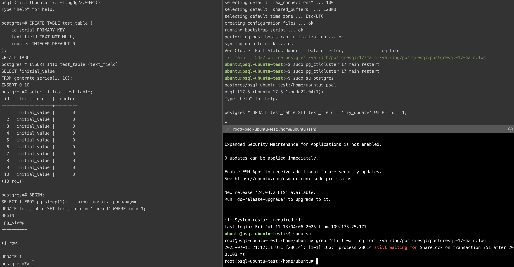
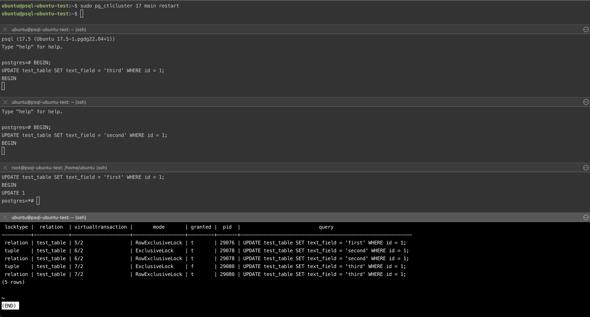
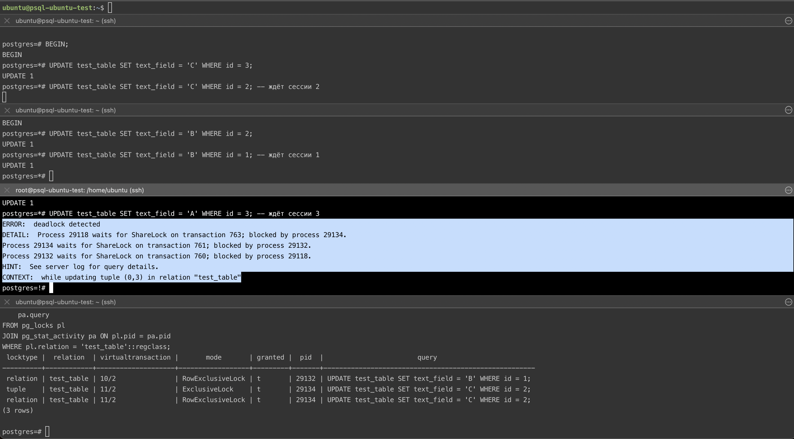

## Механизм блокировок

## Цель:
- понимать как работает механизм блокировок объектов и строк.

### Задание:
1. Настройте сервер так, чтобы в журнал сообщений сбрасывалась информация о блокировках, удерживаемых более 200 миллисекунд. 
Воспроизведите ситуацию, при которой в журнале появятся такие сообщения.
```bash
psql -c 'ALTER SYSTEM SET log_lock_waits = "on";'
psql -c 'ALTER SYSTEM SET log_min_duration_statement = 0;'
psql -c 'ALTER SYSTEM SET log_line_prefix = "%t [%p]: [%l-1] ";'
psql -c 'ALTER SYSTEM SET deadlock_timeout = "200ms";'

sudo pg_ctlcluster 17 main restart

psql -c 'SHOW deadlock_timeout;'
 deadlock_timeout
------------------
 200ms
(1 row)
```

Моделирование
```postgresql
psql postgres

-- Создаем таблицу
CREATE TABLE test_table (
    id serial PRIMARY KEY,
    text_field TEXT NOT NULL,
    counter INTEGER DEFAULT 0
);

-- Заполняем тестовыми данными
INSERT INTO test_table (text_field)
SELECT 'initial_value'
FROM generate_series(1, 10);

postgres=# select * from test_table;
 id |  text_field   | counter
----+---------------+---------
  1 | initial_value |       0
  2 | initial_value |       0
  3 | initial_value |       0
  4 | initial_value |       0
  5 | initial_value |       0
  6 | initial_value |       0
  7 | initial_value |       0
  8 | initial_value |       0
  9 | initial_value |       0
 10 | initial_value |       0
(10 rows)
 
 -- Сессия 1
BEGIN;
UPDATE test_table SET text_field = 'locked' WHERE id = 1;

-- Сессия 2
UPDATE test_table SET text_field = 'try_update' WHERE id = 1;
```



2. Смоделируйте ситуацию обновления одной и той же строки тремя командами UPDATE в разных сеансах.
Изучите возникшие блокировки в представлении pg_locks и убедитесь, что все они понятны. 
Пришлите список блокировок и объясните, что значит каждая.
```postgresql
-- Сессия 1
BEGIN;
UPDATE test_table SET text_field = 'first' WHERE id = 1;

-- Сессия 2
BEGIN;
UPDATE test_table SET text_field = 'second' WHERE id = 1;

-- Сессия 3
BEGIN;
UPDATE test_table SET text_field = 'third' WHERE id = 1;

SELECT 
    pl.locktype,
    pl.relation::regclass,
    pl.virtualtransaction,
    pl.mode,
    pl.granted,
    pl.pid,
    pa.query
FROM pg_locks pl
JOIN pg_stat_activity pa ON pl.pid = pa.pid
WHERE pl.relation = 'test_table'::regclass;
```


29076 - relation/RowExclusiveLock - блокировка уровня страницы - наложена 1ым сеансов в транзакции, другие могут читьаь
29078 - relation/RowExclusiveLock - то же, что выше
29078 - tuple/ExclusiveLock - это уже блокировка на уровне конкретной строки
для 29080 то же, что и для 29078, только tuple/ExclusiveLock ожидает снятия от 29078 и будет выполнен сразу после ее выполнения

3. Воспроизведите взаимоблокировку трех транзакций. Можно ли разобраться в ситуации постфактум, изучая журнал сообщений?
```postgresql
-- Сессия 1
BEGIN;
UPDATE test_table SET text_field = 'A' WHERE id = 1;
-- Ждём, не завершая транзакции

-- Сессия 2
BEGIN;
UPDATE test_table SET text_field = 'B' WHERE id = 2;
-- продолжаем
UPDATE test_table SET text_field = 'B' WHERE id = 1; -- ждёт сессии 1

-- Сессия 3
BEGIN;
UPDATE test_table SET text_field = 'C' WHERE id = 3;
UPDATE test_table SET text_field = 'C' WHERE id = 2; -- ждёт сессии 2

-- Сессия 1 (продолжение)
UPDATE test_table SET text_field = 'A' WHERE id = 3; -- ждёт сессии 3
-- возникает deadlock
```


> Вообще, разобраться можно, увидим все в логах системы. При этом достаточно подробно.
```bash
grep "deadlock" /var/log/postgresql/postgresql-17-main.log  -A 10

2025-07-11 21:08:27 UTC [28566]: [1-1] LOG:  duration: 10.584 ms  statement: ALTER SYSTEM SET deadlock_timeout = "200ms";
2025-07-11 21:08:29 UTC [28534]: [5-1] LOG:  received fast shutdown request
2025-07-11 21:08:29 UTC [28534]: [6-1] LOG:  aborting any active transactions
2025-07-11 21:08:29 UTC [28534]: [7-1] LOG:  background worker "logical replication launcher" (PID 28540) exited with exit code 1
2025-07-11 21:08:29 UTC [28535]: [1-1] LOG:  shutting down
2025-07-11 21:08:29 UTC [28535]: [2-1] LOG:  checkpoint starting: shutdown immediate
2025-07-11 21:08:29 UTC [28535]: [3-1] LOG:  checkpoint complete: wrote 3 buffers (0.0%); 0 WAL file(s) added, 0 removed, 0 recycled; write=0.005 s, sync=0.004 s, total=0.028 s; sync files=2, longest=0.002 s, average=0.002 s; distance=0 kB, estimate=0 kB; lsn=0/1525548, redo lsn=0/1525548
2025-07-11 21:08:29 UTC [28534]: [8-1] LOG:  database system is shut down
2025-07-11 21:08:29 UTC [28581]: [1-1] LOG:  starting PostgreSQL 17.5 (Ubuntu 17.5-1.pgdg22.04+1) on x86_64-pc-linux-gnu, compiled by gcc (Ubuntu 11.4.0-1ubuntu1~22.04) 11.4.0, 64-bit
2025-07-11 21:08:29 UTC [28581]: [2-1] LOG:  listening on IPv4 address "127.0.0.1", port 5432
2025-07-11 21:08:29 UTC [28581]: [3-1] LOG:  listening on Unix socket "/var/run/postgresql/.s.PGSQL.5432"
--
2025-07-11 21:08:48 UTC [28599]: [1-1] LOG:  duration: 0.162 ms  statement: SHOW deadlock_timeout;
2025-07-11 21:10:40 UTC [28605]: [1-1] LOG:  duration: 6.569 ms  statement: CREATE TABLE test_table (
	    id serial PRIMARY KEY,
	    text_field TEXT NOT NULL,
	    counter INTEGER DEFAULT 0
	);
2025-07-11 21:10:58 UTC [28605]: [2-1] LOG:  duration: 2.465 ms  statement: INSERT INTO test_table (text_field)
	SELECT 'initial_value'
	FROM generate_series(1, 10);
2025-07-11 21:11:07 UTC [28605]: [3-1] LOG:  duration: 0.141 ms  statement: select * from test_table;
2025-07-11 21:11:52 UTC [28605]: [4-1] LOG:  duration: 0.043 ms  statement: BEGIN;
--
2025-07-11 21:37:01 UTC [29118]: [3-1] LOG:  process 29118 detected deadlock while waiting for ShareLock on transaction 763 after 200.132 ms
2025-07-11 21:37:01 UTC [29118]: [4-1] DETAIL:  Process holding the lock: 29134. Wait queue: .
2025-07-11 21:37:01 UTC [29118]: [5-1] CONTEXT:  while updating tuple (0,3) in relation "test_table"
2025-07-11 21:37:01 UTC [29118]: [6-1] STATEMENT:  UPDATE test_table SET text_field = 'A' WHERE id = 3;
2025-07-11 21:37:01 UTC [29118]: [7-1] ERROR:  deadlock detected
2025-07-11 21:37:01 UTC [29118]: [8-1] DETAIL:  Process 29118 waits for ShareLock on transaction 763; blocked by process 29134.
	Process 29134 waits for ShareLock on transaction 761; blocked by process 29132.
	Process 29132 waits for ShareLock on transaction 760; blocked by process 29118.
	Process 29118: UPDATE test_table SET text_field = 'A' WHERE id = 3;
	Process 29134: UPDATE test_table SET text_field = 'C' WHERE id = 2;
	Process 29132: UPDATE test_table SET text_field = 'B' WHERE id = 1;
2025-07-11 21:37:01 UTC [29118]: [9-1] HINT:  See server log for query details.
2025-07-11 21:37:01 UTC [29118]: [10-1] CONTEXT:  while updating tuple (0,3) in relation "test_table"
2025-07-11 21:37:01 UTC [29118]: [11-1] STATEMENT:  UPDATE test_table SET text_field = 'A' WHERE id = 3;
2025-07-11 21:37:01 UTC [29132]: [7-1] LOG:  process 29132 acquired ShareLock on transaction 760 after 87501.880 ms
```

4. Могут ли две транзакции, выполняющие единственную команду UPDATE одной и той же таблицы (без where), заблокировать друг друга?
> Нет, если нет триггеров, правила или индексированного поля. PostgreSQL не блокирует всю таблицу полностью, а использует строчные блокировки. Если две транзакции не затрагивают одни и те же строки — взаимоблокировки не будет.
> Однако при наличии триггеров, select for update или nowait может возникнуть конкуренция за постраничные блокировки
