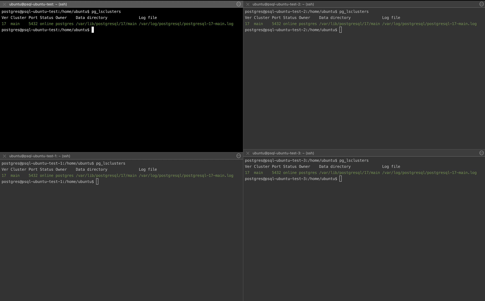
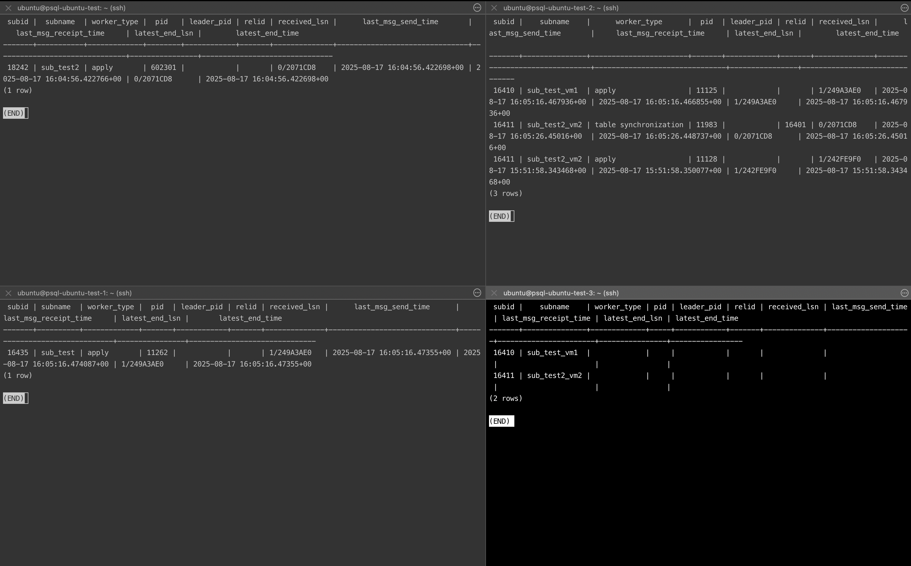

## Репликация

## Цель:
- реализовать свой мини-кластер на 3 ВМ.

### Задание:
1. На 1 ВМ создаем таблицы test для записи, test2 для запросов на чтение; 
2. Создаем публикацию таблицы test и подписываемся на публикацию таблицы test2 с ВМ №2;
3. На 2 ВМ создаем таблицы test2 для записи, test для запросов на чтение;
4. Создаем публикацию таблицы test2 и подписываемся на публикацию таблицы test1 с ВМ №1;
5. 3 ВМ использовать как реплику для чтения и бэкапов (подписаться на таблицы из ВМ №1 и №2);

* реализовать горячее реплицирование для высокой доступности на 4ВМ. Источником должна выступать ВМ №3. Написать с какими проблемами столкнулись.


1. Установим PostgreSQL на каждую ВМ:
Intel Ice Lake, 2 CPU/4 GB RAM; 50 GB SSD; Ubuntu 22.04
```bash
sudo apt update && sudo apt upgrade -y && sudo sh -c 'echo "deb http://apt.postgresql.org/pub/repos/apt $(lsb_release -cs)-pgdg main" > /etc/apt/sources.list.d/pgdg.list' && wget --quiet -O - https://www.postgresql.org/media/keys/ACCC4CF8.asc | sudo apt-key add - && sudo apt-get update && sudo apt-get -y install postgresql-17
```


2. Проставим параметр wal_level='logical', а также listen_addresses='*' для ВМ и перезагружаем сервер:
```bash
vi /etc/postgresql/17/main/postgresql.conf
sudo systemctl restart postgresql
```


3. Настроим уровень доступа для репликации, посредством редактирования pg_hba.conf
> Все ВМ посадил в одну виртуальную сеть, оттого коммуникацию между ними буду обеспечивать так же на внутренних адресах (трафик через FIP наружу не погоню).
> Также нужно не забыть открыть порт 5432 на ВМках на входящий и исходящий трафик, иначе фаерволл заблокирует
```bash
psql -t -P format=unaligned -c 'show hba_file';
vim /etc/postgresql/17/main/pg_hba.conf

# ВМ test
# Разрешить ВМ test-1 подключаться для логической репликации
host    cluster_db      replicator      10.0.0.91/32       scram-sha-256
host    replication     replicator      10.0.0.91/32       scram-sha-256

# Разрешить ВМ test-2 читать данные (логическая репликация)
host    cluster_db      replicator      10.0.0.157/32       scram-sha-256
host    replication     replicator      10.0.0.157/32       scram-sha-256

---
# ВМ test-1
# Разрешить ВМ test подключаться для логической репликации
host    cluster_db      replicator      10.0.0.83/32       scram-sha-256
host    replication     replicator      10.0.0.83/32       scram-sha-256

# Разрешить ВМ test-2 читать данные (логическая репликация)
host    cluster_db      replicator      10.0.0.157/32       scram-sha-256
host    replication     replicator      10.0.0.157/32       scram-sha-256

---
# ВМ test-2
# Разрешить ВМ test-3 делать streaming-репликацию
host    replication     replicator      10.0.0.250/32       scram-sha-256

# перезагрузим конфиг
psql -c 'SELECT pg_reload_conf();'
```


4. Создадим учетную запись для репликации в БД на ВМ1, ВМ2, ВМ3:
```postgresql
CREATE USER replicator WITH REPLICATION ENCRYPTED PASSWORD 'replicator';
```


5. Настроим ВМ1:
```postgresql
CREATE DATABASE cluster_db;
\c cluster_db

-- Таблица для записи
CREATE TABLE test (
    id serial PRIMARY KEY,
    data text,
    created_at timestamptz DEFAULT now()
);

-- Таблица для чтения (из ВМ2)
CREATE TABLE test2 (
    id serial PRIMARY KEY,
    data text,
    created_at timestamptz DEFAULT now()
);

-- Предоставим грант пользователю
GRANT SELECT ON TABLE test TO replicator;
GRANT SELECT ON TABLE test2 TO replicator;

-- Создадим публикацию
CREATE PUBLICATION pub_test FOR TABLE test;

-- Настроим подписку на ВМ2
CREATE SUBSCRIPTION sub_test2
CONNECTION 'host=10.0.0.91 port=5432 dbname=cluster_db user=replicator password=replicator'
PUBLICATION pub_test2
WITH (copy_data = true);
```

6. Настроим ВМ2:
```postgresql
CREATE DATABASE cluster_db;
\c cluster_db

-- Таблица для записи
CREATE TABLE test2 (
    id serial PRIMARY KEY,
    data text,
    created_at timestamptz DEFAULT now()
);

-- Таблица для чтения (из ВМ1)
CREATE TABLE test (
    id serial PRIMARY KEY,
    data text,
    created_at timestamptz DEFAULT now()
);

-- Предоставим грант пользователю
GRANT SELECT ON TABLE test TO replicator;
GRANT SELECT ON TABLE test2 TO replicator;

-- Создадим публикацию
CREATE PUBLICATION pub_test2 FOR TABLE test2;

-- Настроим подписку на ВМ1
CREATE SUBSCRIPTION sub_test
CONNECTION 'host=10.0.0.83 port=5432 dbname=cluster_db user=replicator password=replicator'
PUBLICATION pub_test
WITH (copy_data = true);
```

7. Настроим ВМ3:
```postgresql
CREATE DATABASE cluster_db;
\c cluster_db

CREATE TABLE test (
    id serial PRIMARY KEY,
    data text,
    created_at timestamptz DEFAULT now()
);

CREATE TABLE test2 (
    id serial PRIMARY KEY,
    data text,
    created_at timestamptz DEFAULT now()
);

-- Предоставим грант пользователю
GRANT SELECT ON TABLE test TO replicator;
GRANT SELECT ON TABLE test2 TO replicator;

-- Настроим подписку с ВМ1
CREATE SUBSCRIPTION sub_test_vm1
CONNECTION 'host=10.0.0.83 port=5432 dbname=cluster_db user=replicator password=replicator'
PUBLICATION pub_test
WITH (copy_data = true);

-- Настроим подписку с ВМ2
CREATE SUBSCRIPTION sub_test2_vm2
CONNECTION 'host=10.0.0.91 port=5432 dbname=cluster_db user=replicator password=replicator'
PUBLICATION pub_test2
WITH (copy_data = true);
```


8. Настроим ВМ4
```bash
# остановим процесс и очистим данные
sudo systemctl stop postgresql
sudo su postgres
rm -rf /var/lib/postgresql/17/main/*

# сделаем физическую копию с ВМ3
sudo su postgres
pg_basebackup \
    -h 10.0.0.157 \
    -U replicator \
    -D /var/lib/postgresql/17/main \
    -P -v -R -X stream -C -S vm4_standby

# запустим БД
sudo systemctl start postgresql

# Убедимся, что на ВМ3 появился слот-репликации
SELECT * FROM pg_stat_get_wal_senders();
  pid  |   state   | sent_lsn  | write_lsn | flush_lsn | replay_lsn |    write_lag    |    flush_lag    |   replay_lag    | sync_priority | sync_state |          reply_time
-------+-----------+-----------+-----------+-----------+------------+-----------------+-----------------+-----------------+---------------+------------+-------------------------------
 11499 | streaming | 0/3017AB8 | 0/3017AB8 | 0/3017AB8 | 0/3017AB8  | 00:00:00.000741 | 00:00:00.002051 | 00:00:00.002153 |             0 | async      | 2025-08-17 15:40:01.879645+00
(1 row)

# Убедимся, что ВМ4 в режиме standby
psql -d cluster_db -c 'SELECT pg_is_in_recovery();'
 pg_is_in_recovery
-------------------
 t
(1 row)
# действительно, в режиме репликации
```


9. Тестируем:
```postgresql

-- Проверяем на ВМ1, ВМ2, ВМ3 и ВМ4, что изначально таблицы пустые
SELECT * FROM test;
SELECT * FROM test2;

-- Подключаемся к БД на ВМ1
psql -d db_customer

-- Вставляем 10000 строк с автогенерацией
INSERT INTO test (data, created_at)
SELECT 
    'VM1-data-' || g AS data,
    NOW() - INTERVAL '1 day' * (10 - g) AS created_at
FROM generate_series(1, 10000) AS g;
--- 

-- Подключаемся к БД на ВМ2
psql -d db_customer

-- Вставляем 10000 строк
INSERT INTO test2 (data, created_at)
SELECT 
    'VM2-data-' || g AS data,
    NOW() - INTERVAL '1 hour' * (10 - g) AS created_at
FROM generate_series(1, 10000) AS g;

--- На ВМ1 глядим данные в test2
SELECT * FROM test2 ORDER BY created_at DESC LIMIT 10;

--- На ВМ2 глядим данные в test
SELECT * FROM test ORDER BY created_at DESC LIMIT 10;

--- На ВМ3, ВМ4 извлекаем данные
SELECT * FROM test ORDER BY created_at DESC LIMIT 10;
SELECT * FROM test2 ORDER BY created_at DESC LIMIT 10;
```
